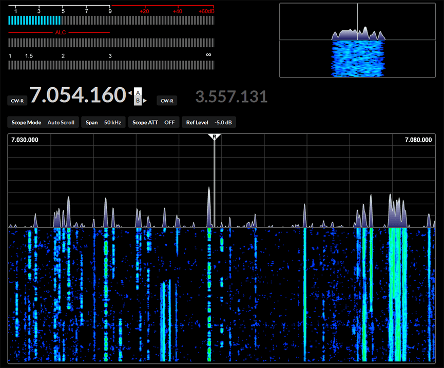

# open890

open890 is a web-based UI for the Kenwood TS-890S amateur radio, and features good usability, 
clean design, and high-speed bandscope/audio scope displays, among other features not available
either on the radio itself, or in the ARCP remote control software.

It is currently only designed to interface with the TS-890 via a LAN (or wifi) connection, and not
a USB/serial connection. It may work with the TS-990, as the command set is very similar, but is
currently untested.

## Installation from source

See [Installing From Source](https://github.com/tonyc/open890/wiki/Installing-From-Source)

## Binary releases

Binary releases are available from [releases](https://github.com/tonyc/open890/releases/).

### Linux

Linux binaries are supported to run on 64-bit Ubuntu 20.04, although other modern Linux releases may work (or not).

Download the release `.tar.gz`

Then, decide where you want open890 to live, usually somewhere in your home directory.

    cd <where you want it>
    tar zxvf /path/to/open890-release.tar.gz
    
You will then get a subdirectory called `open890`.

    cd open890
    ./bin/open890 start

If you encounter an error related to shared libraries, etc, they _may_ be solved by installing the correct version,
although the correct packages may not be available in your OS distribution's package manager. 

If all else fails, install from source.

### Windows

Download the Windows release .zip file, and extract it somewhere useful.

Open a command prompt, `cd` to where you extracted the files, and run:

    bin\open890.bat start

#### "Windows Protected your PC"

Since I haven't paid for a certificate to sign binaries, Windows will loudly complain about an unknown developer. 

 * Click "More Info" and choose "Run anyway". 

If you are concerned about the safety of the files, **only ever download direct from the Github releases page**, and additionally, compare the MD5 checksum from the release notes with the file you have. An internet search for "Windows MD5 tool" will yield several results if you are concerned.

#### Windows Security Alert

On first run, you will likely receive a warning from Windows stating, "Windows Defender Firewall has blocked some features of this app" - For one or more of the following files:

 * erl.exe
 * epmd.exe

This is due to open890's client-server architecture, and it needs permission to open a port (4000) for the local webserver. Only choose the "private network" option for open890.

## Getting Help

If you encounter a bug, please [open a discussion](https://github.com/tonyc/open890/discussions). Please do not directly email me for technical support!

## Contributing

* [Start a discussion](https://github.com/tonyc/open890/discussions) so we can discuss your idea
* Fork this repository
* Make your changes in a branch in your own repo
* Open a pull request!

## Legal mumbo-jumbo

This project is licensed under the MIT license. Please see [MIT-LICENSE](MIT-LICENSE) for more details.

All product names, logos, brands, trademarks and registered trademarks are property of their respective owners. All company, product and service names used in this software are for identification purposes only.

